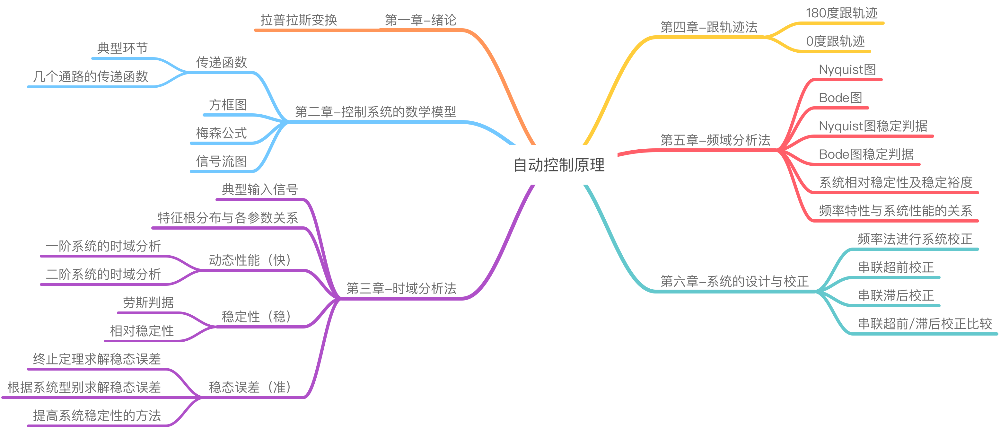

# 自动控制原理

[toc]

------

## 知识域 | Body of Knowledge

 

## 文档 | Documents

> 关注微信公众号「**济济一堂**」，后台回复「**自动控制**」即可获取

- 自动控制原理笔记(完整版)
- 自动控制期末重点习题集(整合版)
- 自动控制复习大纲(2009级车辆工程版)
- 自动控制试题(丰富版)

 

## 项目结构 | Project Structure

- `doc/`：《自动控制原理》课程笔记 & 习题
  - [第一章-绪论](https://github.com/doubleZ0108/Automatic-Control-Principles/blob/master/doc/第一章-绪论.md)
  - [第二章-控制系统的数学模型](https://github.com/doubleZ0108/Automatic-Control-Principles/blob/master/doc/第二章-控制系统的数学模型.md)
  - [第三章-时域分析法](https://github.com/doubleZ0108/Automatic-Control-Principles/blob/master/doc/第三章-时域分析法.md)
  - [第四章-跟轨迹](https://github.com/doubleZ0108/Automatic-Control-Principles/blob/master/doc/第四章-跟轨迹.md)
  - [第五章-频域分析](https://github.com/doubleZ0108/Automatic-Control-Principles/blob/master/doc/第五章-频域分析.md)
  - [第六章-系统的设计与校正](https://github.com/doubleZ0108/Automatic-Control-Principles/blob/master/doc/第六章-系统的设计与校正.md)
  - [习题集](https://github.com/doubleZ0108/Automatic-Control-Principles/blob/master/doc/习题集.md)
- `homework/`：《自动控制原理》作业
  - [一～六章作业 (五次作业)](https://github.com/doubleZ0108/Automatic-Control-Principles/tree/master/homework)
  - [作业答案](https://github.com/doubleZ0108/Automatic-Control-Principles/blob/master/homework/自控答案.docx)

 

## 关于作者 | About the Author

| 姓名         | 张喆                                                 |
| ------------ | ---------------------------------------------------- |
| **指导老师** | [赵霞](https://see.tongji.edu.cn/info/1156/4412.htm) |
| **课程名字** | 人工智能微专业 - 自动控制原理                        |
| **联系方式** | [dbzdbz@tongji.edu.cn](mailto:dbzdbz.tongji.edu.cn)  |