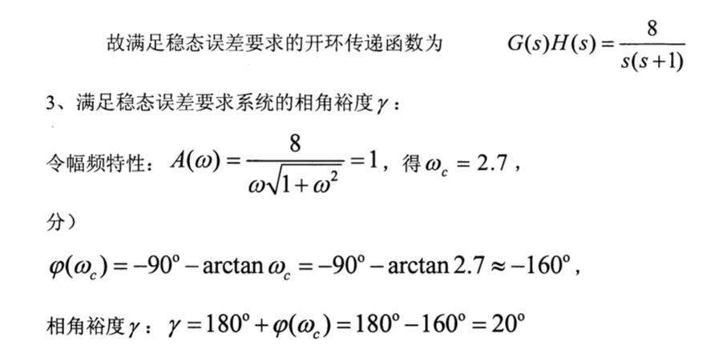
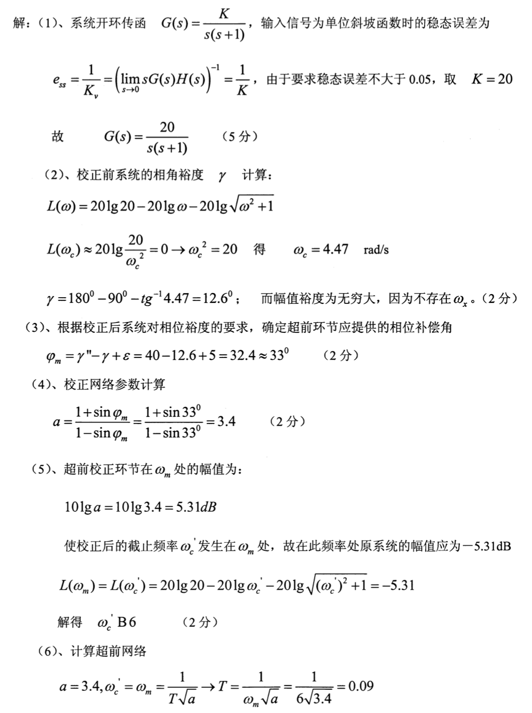
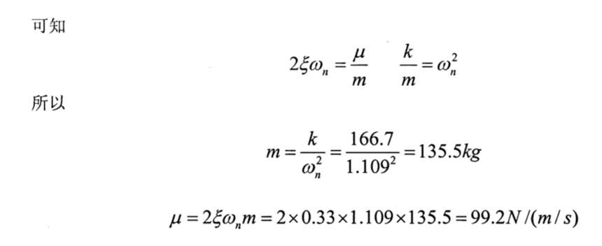

# 自动控制期末习题集

[toc]

------

## 一些概念

- **最小相位系统**：开环所有零点和极点都在S平面左侧
- **传递函数**的定义是对于线性定常系统，在<u>初始条件为零的条件下</u>，系统<u>输出量的拉氏变换与输入量的拉氏变换之比</u>
  - 传递函数的组成与输入、输出信号无关，仅仅决定于<u>系统本身的结构和参数</u>,并且只适于<u>零初始条件下的线性定常系统</u>
- **频率响应**是<u>系统对正弦输入稳态响应</u>
- **频率特性**包括<u>幅频</u>和<u>相频</u>两种特性。
- **开环增益**：$\lim _{s \rightarrow 0} s^{v} G(s) H(s)=K$
- Nequist图中p是<u>右半平面</u>极点个数
- 注意二阶系统稳定误差和型别的关系里，加速度信号系数是 A/2

## 判断题

- 传递函数不仅取决于系统的结构参数,给定输入和扰动对传递函数也有影响 ❌
- 闭环传函极点决定系统的稳定性 √
- 若系统增加合适的开环零点，会增加系统的信噪比 ❌

## 选择/填空

- 下列哪种措施对改善系统的精度没有效果（增加微分环节）
- 高阶系统的主导闭环极点越靠近虚轴,则系统的（响应速度越慢）
- 线性系统的对数幅频特性，纵坐标取值为（$20lg|G(jw)|$），横坐标为（w按对数分度）
- 奈奎斯特稳定判据中, Z=P-R ,其中P是指（开环传函中具有正实部极点的个数），Z指（闭环传函中具有正实部极点的个数），R指（Nequist曲线逆时针包围(-1,j0)点的整圈数）
- 若两个系统跟轨迹相同，则有相同的（闭环极点）
- 为保证系统的稳定性，要求开环对数幅频特性曲线在穿越频率处的斜率为（-20dB/十倍频程），可以保证相角裕度在30~60度之间

------

## 幅频特性 & 相频特性

$$
\frac{K(\tau s + 1)}{s(Ts+1)}
$$

------

------

------

## 梅森公式

------

## 跟轨迹 + 欠阻尼时K的取值 + 开环增益

【dK/ds + 劳斯判据】

【1/d + 直接带入s=jw】

**【k取值 阻尼 系统状态】**

------

## Bode图

1. 已经会做了

------

------

## 剪切频率$w_c$ & 相角裕度$\gamma$

------

## 稳态误差

------

## 串联超前校正

------

## 干扰传递函数系列

------

## 拉普拉斯变换

------

## 微分方程

### 电路

### 弹簧

------

------

## 其他

