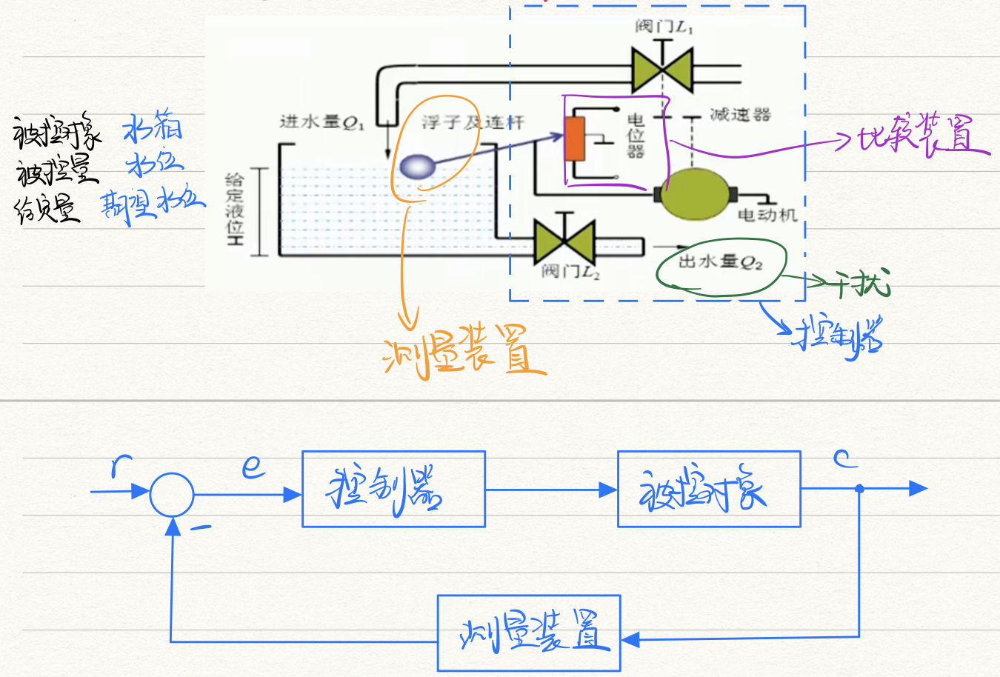
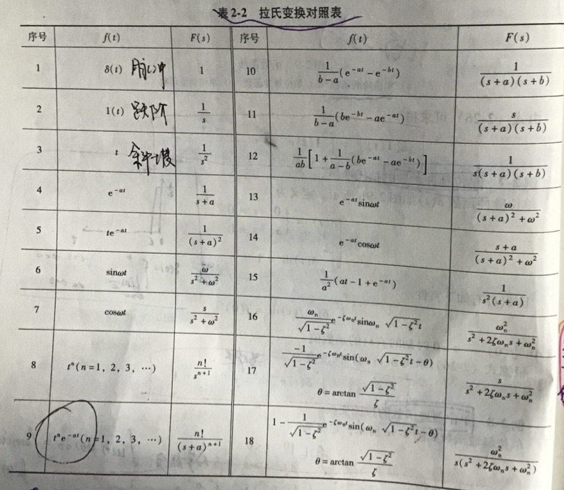

# 第一章 绪论

- **🌟自动控制系统的组成**：控制器、被控对象、被控量、（测量装置）、（比较装置）

  

- 反馈控制：控制作用通过<u>给定量</u>和<u>反馈量</u>的差值进行的

- **分类**

  - 信号传递路径
    - 开环控制：输入与输出没有反馈回路，系统==稳定==；输出不会影响控制器的决策；*没法自行消除扰动误差*
    - 闭环控制：负反馈；==精度高==，将输出信号引回输入端，与输入信号比较，期望偏差越来越小；*复杂，可能超调、震荡、不稳定*
    - 复合控制
  - 输入信号
    - 恒值控制
    - 随动(伺服)控制：被控量是预先位置的函数，要求以尽可能小的误差跟随   🌰拦截导弹
    - 程序控制：被控量按预定规律变化
  - 信号
    - 连续控制：  🌰PID
    - 离散控制：  🌰数字控制系统(有CPU)
  - 元件特性：线性控制 / 非线性控制

- **自动控制基本要求**

  - 稳定性
  - 快速性：但也不是越快越好，🌰飞机自动驾驶遇气流要平稳回复
  - 准确性

- **方法**：时域法 / 复域法 / 频域法

## 拉普拉斯变换

