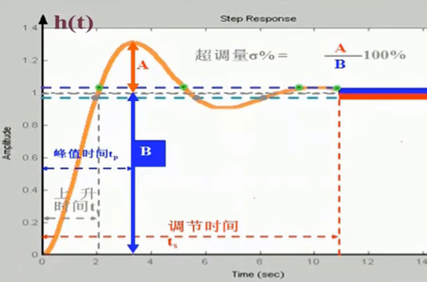

# 第三章 时域分析法

* [典型输入信号](#典型输入信号)
* [特征根分布与各参数关系](#特征根分布与各参数关系)
* [动态性能指标（快）](#动态性能指标快)
   * [一阶系统的时域分析](#一阶系统的时域分析)
   * [二阶系统的时域分析](#二阶系统的时域分析)
* [稳定性（稳）](#稳定性稳)
   * [劳斯判据](#劳斯判据)
   * [相对稳定性｜稳定的程度](#相对稳定性稳定的程度)
   * [赫尔维茨判据（略）](#赫尔维茨判据略)
* [稳态误差（准）](#稳态误差准)
   * [终值定理求解稳态误差](#终值定理求解稳态误差)
   * [根据系统型别求解稳态误差](#根据系统型别求解稳态误差)
   * [提高系统稳定性的方法](#提高系统稳定性的方法)

-----

根据系统输入的时域表达式分析系统

- **🌟系统阶次**：传递函数分母的最高阶次

- **两种响应**

  - 动态响应：系统在典型输入信号的激励后，输入量从初态到终态的响应过程
  - 稳态响应：～，时间趋于$\infin$时，系统输出量的表现形式

- **运动模态**（不太懂这个是干什么的）

  

  - 瞬态分量
  - 稳态分量

- **高阶系统的时间响应**：阶次太高极点太多，通常化为一、二阶加以分析

  - 主导极点：离虚轴最近的一两个闭环极点起主导作用，远的极点很快就衰减完了
  - 零点和极点共同决定系统响应曲线形状
  - 稳态：由输入信号决定
  - 暂态：由传递函数决定

## 典型输入信号

- **阶越**：$r(t) = R \quad L(S) = \frac{R}{s}$

- **斜坡（速度函数**）：$r(t) = Rt \quad L(S) = \frac{R}{s^2}$

- **加速度**：$r(t) = Rt^2 \quad L(S)=\frac{2R}{s^3}$

- **正弦**：$r(t)=sinwt \quad L(S)=\frac{w}{s^2+w^2}$

- **单位脉冲**

  

## 特征根分布与各参数关系

## 动态性能指标（快）

> 在阶越函数作用下，～

- 峰值时间$t_p$：第一次达到峰值

- 上升时间$t_r$：第一次达到稳态值

- 调节时间$t_s$：响应达到允许的误差带

- 延迟时间$t_d$：第一次达到稳态值一半的时间

- 超调量$\sigma \%$：$\sigma \% = \frac{c(t_p) - c(\infin)}{c(\infin)}$

- 振荡次数$N$：0~$t_p$中，穿越稳态值次数的一半

  > - $t_r$, $t_p$: 反映系统响应速度
  > - $\sigma$, $N$: 反映系统阻尼程度
  > - $t_s$: 综合指标

### 一阶系统的时域分析

> 时域分析方法都是：
> $$
> C(s) = \Phi(s)R(s) \\
> C(t) = L^{-1}[C(s)]
> $$

$$
\Phi(S) = \frac{1}{Ts + 1}
$$

- 输入阶越，响应速度与时间T成反比，T越小响应速度越快
- 单位速度信号，随着时间的推移（逐渐稳定），输出与输入始终有一个差值
- 单位家速度信号，误差会越来越大
- 输入信号导数的响应 = 其响应的导数

> ⚗️【详细推导】 P19

### 二阶系统的时域分析

$$
\Phi(S) = \frac{w_n^2}{s^2+2\zeta w_nS+w_n^2}
$$

- $w_n$：无阻尼自振角频率
- $\zeta$：阻尼比
- $w_d=w_n \sqrt{1-\zeta^2}$：有阻尼自振角频率
- $w_r=w_n\sqrt{1-2\zeta^2}$：谐振频率
  - $\zeta > \frac{1}{\sqrt{2}}$时无谐振，但只要$0<\zeta<1$，就会出现超调和振荡
  - 谐振峰值$M_r=\frac{1}{2\zeta\sqrt{1-\zeta^2}}$

> ⚗️ 【阻尼比与特征根的关系】 P21

**🌟【公式】**

- $w_d = w_n\sqrt{1-\zeta^2}$
- 上升时间 $t_r = \frac{\pi - \beta}{w_d} \quad \beta = cos^{-1}\zeta$
- 峰值时间 $t_p = \frac{\pi}{w_d}$
- 超调量 $\sigma \% = e^{-\frac{\pi \zeta}{\sqrt{1-\zeta^2}}} \times \%$
- 调整时间 $t_s = \frac{3.5}{\zeta w_n} (取误差带\Delta=5\%) \\ t_s = \frac{4.4}{\zeta w_n} (取误差带\Delta=2\%)$ 
- 振荡次数 $N = \frac{t_s}{2t_p}$

**【阶越信号】**

- 欠阻尼：振荡指数衰减，$\zeta$越小，振荡越距离，衰减速度越慢
- 临界阻尼：无超调   🌰汽车自动定位不可能调过头再调回来，只能越来越近
- 过阻尼
- 零阻尼：输出时等幅振荡（偏移1）
  - 如果系统以$w_n$做等幅震荡，则系统特征根必有共轭虚根，系统处于临界稳定状态

**【阶越信号 - 以欠阻尼为例分析动态性能】**

- 阻尼比一定时，系统响应速度与$w_d$成正比
- $w_n$一定时，阻尼比越小，上升时间越短
- 超调量只与阻尼比有关，$\zeta=1$时，无超调
- 误差带通常取5%或2%
- 工程上通常采用欠阻尼，对二阶系统一般取$\zeta = 0.4 \sim 0.8$

> 🌰【二阶系统对单位脉冲的响应】P24
>
> 将二阶系统单位阶越响应对时间求导即可得到

> 🌰【时域分析例题】*2 P23
>
> 给出或要求解 $\sigma, t_p, K, t_r, t_s, N$这些东西的看过来 

## 稳定性（稳）

当扰动消失后，由初始偏差状态恢复到原平衡状态的性能

- **不稳定系统**：稍微扰动，就恢复不过来了   🌰小球放在斜坡上，轻微一碰就滚下去回不来了
- **🌟稳定判据**：所有<u>闭环特征方程</u>的根都在S的左半平面（负实部）
  - 闭环传递函数的分母
- **临界稳定**：闭环极点实部为零，其余极点都有负实部
  - 输出信号等幅振荡
  - 在工程上是不稳定的（参数很容易变化）

### 劳斯判据

🌟用的是闭环特征方程$1+G(s)H(s) = 0$
$$
a_{0} S^{n}+a_{1} S^{n-1}+\cdots+a_{n-1} S+a_{n}=0
$$

- **根本目的**：特征方程不好求解，不好验证所有根是不是都有负实部，希望通过代数的方法解决
- **必要条件**：系统特征方程系数$a_i > 0$

**🌟【劳斯表】**

- 劳斯表第一列系数均为正，系统稳定
- 符号*<u>变化的次数</u>*等于特征方程在S右半平面上根的个数

**【特殊情况】**：此时系统是临界稳定或不稳定

1. 某行第一项为零，该行其余项不全为零
   - 以很小的<u>*正数*</u>$\varepsilon$代替零继续完成劳斯表
2. 有全零行
   - 用全零行的上一行系数构造一个辅助多项式，用其倒数的系数替代该行
   - 辅助方程的根也一定是特征方程的根
   - 第一列符号有变化 => 不稳定
   - 第一列夫好相同 => 临界稳定

> 🌰【劳斯表｜系统稳定性例题*2】P27

### 相对稳定性｜稳定的程度

- 离虚轴越近越不稳定

- 如果正好落到虚轴，则临界稳定，一不小心就不稳定了

- **🌟提高系统稳定性**：

  - 增加串联超前/滞后校正装置
  - 增加开环<u>*零点*</u>
  - 增加PI/PD/PID控制器
  - 在积分环节外加单位负反馈

  > 不在这里的谨慎选择，应该都是错误选项

**【劳斯判据 - 判断是否在直线$s=a$左侧】**

令$S=Z+a$带入原始方程中，得到以Z为变量的特征方程，再用劳斯判据

> 🌰【劳斯表判断是否谓语s=-1左侧】
>
> 

### 赫尔维茨判据（略）

- 赫尔维茨行列式$D_k$全为正，则系统稳定

## 稳态误差（准）

- **原理性误差**：输入信号和扰动信号引起的稳态误差（不讨论制造误差等）

- **稳态性能**：跟踪输入 或 一致扰动的能力

- **无差系统**：阶越的作用下没有原理性稳态误差

- **误差公式**

  

  - 误差传函$\Phi_e(S)$：$\frac{1}{H(S)} * \frac{1}{1+G(S)H(S)}$
  - 输入引起的误差$E_r$：$\Phi_e(S)R(S)$
  - 扰动引起的误差$E_n$：$-\Phi_N(S)N(S)$
    - $\Phi_N(S) = \frac{-G_2(S)}{1+G_1(S)G_2(S)H(S)}$

- **系统型别**：系统中积分环节数目｜包含S=0的极点数

  -  $G(S)H(S) = \frac{...}{s^v...}$中的v

- **系统阶次**：分母S的幂次

- **开环增益**：$\lim _{s \rightarrow 0} s^{v} G(s) H(s)=K$

  - 开环增益越大，控制精度越高（但系统稳定要将K限定在某一范围内）

### 终值定理求解稳态误差

$$
e_{ss}(\infin) = lim_{s\rightarrow0}S[E_r(S)+E_n(S)]
$$

- 缺：只能得到$t\rightarrow \infin$的值，不能得到时间表达式

> 🌰【终值定理求解稳态误差】
>
> 

### 根据系统型别求解稳态误差

- K为开环增益：$\lim _{s \rightarrow 0} s^{v} G(s) H(s)=K$

- 阶越信号：要使系统对节约输入不存在稳态误差，必须选用`I`型及以上系统
- 速度信号：`II`型及以上才可能让稳态误差为0
- 加速度信号：`0` `I`型无论怎么调参数都不能追踪上盖信号，且误差越来越大；`II`型能跟踪上但始终有误差；`III`型及以上能完全跟踪上，且稳态误差为零

【其他方法求解稳态误差（略）】

> 🌰【求解稳态误差时间函数】P34
>
> 🌰【误差综合案例】P34

### 提高系统稳定性的方法

- 提高系统开环增益

- 增大系统型别  => 积分环节的个数

  > 但这样会影响系统的稳定性和动态性能

**【复合控制】**

在负反馈控制的基础上增加<u>前馈补偿环节</u>，形成由输入/扰动信号到被控量的前馈通路。此时系统闭环特征方程不变，不影响系统稳定性

- **对扰动进行补偿**

  

- **对输入进行补偿**

  

> 🌰【提高系统稳定性例题】
>
> 