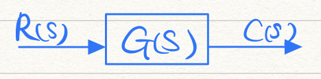
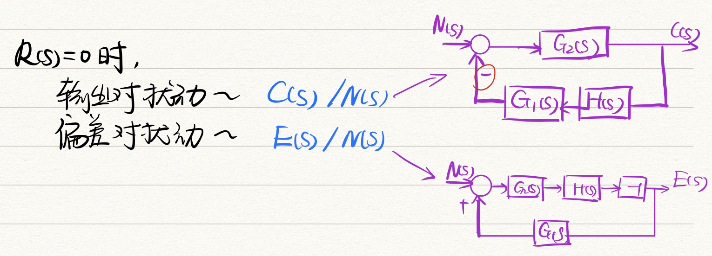

# 第二章 控制系统的数学模型

* [传递函数](#传递函数)
   * [典型环节](#典型环节)
   * [几个通路的传递函数](#几个通路的传递函数)
* [方框图](#方框图)
* [梅森公式](#梅森公式)
* [信号流图](#信号流图)

-----

- **数学模型分类**

  - 静态：各阶导数的代数方程
  - 动态：各阶导数间的微分方程

- **建模方法**

  - 解析法：根据变量间的物理等数学公式
  - 实验法：不知道遵循什么公式，加一激励信号测量输出并进行拟合（但有成本问题）

  1. 时域模型：微分方程、状态方程
  2. 复域模型：传递函数、结构图
  3. 频域模型：频率特性

- **相似系统**：两系统间有相同的数学模型   🌰用电子系统代替机械系统

- **叠加原理**：可叠加性$f_1(t)+f_2(t)$、其次性$Af(t)$

- **非线性系统的线性化**：微偏法/切线法   在给定点邻域将函数展开成泰勒级数，略去一次以上项

  > 负反馈时一般都满足小偏差，这种近似方法比较有实际意义

## 传递函数

$$
传递函数 = \frac{输出的拉氏变换}{输入的拉氏变换}|零初始条件 = \frac{C(S)}{R(S)} = G(S)
$$

$$
G(s)=\frac{C(s)}{R(s)}=\frac{b_{0} s^{m}+b_{1} s^{m-1}+\cdots+b_{n-1} s+b_{m}}{a_{0} s^{n}+a_{1} s^{n-1}+\cdots+a_{n-1} s+a_{n}} \quad(n>m)
$$

- **特征方程**：传递函数分母=0的方程（决定系统的动态特性）
- **特征根(极点)**：特征方程的解
- **系统的阶次**：特征方程中S的最高阶次
- **增益(放大系数)**：系统处于静态时，输出和输入的比值  $k = \frac{b_m}{a_n}$

- 仅取决于系统的<u>结构</u>和<u>参数</u>，与输入和扰动无关
- 仅适用于线性定常系统

> 🌰【电路】
>
> 

> 🌰 【开环传递函数 求 开环增益】
>
> 

### 典型环节

- 比例环节：$G(s) = k$
- 积分环节：$G(s) = \frac{1}{s}$
- 惯性环节：$G(s) = \frac{1}{Ts+1}$
- 微分环节：$G(s) = s$
- 一阶微分环节：$G(S) = \tau s + 1$
- 二阶微分环节：$G(S) = \tau^2s^2+2\zeta \tau s + 1$
- 二阶振荡环节：$G(S) = \frac{1}{T^2s^2 + 2\zeta TS+1}$
- 滞后环节：$G(s) = e^{-s}$

### 几个通路的传递函数

- 扰动$N(S)=0$时

  - 前向通路传递函数：$\frac{C(S)}{E(S)}$

  - 反馈通路传递函数：$\frac{B(S)}{C(S)}$

  - 开环传递函数：$\frac{B(S)}{E(S)}$

  - 闭环传递函数：$\frac{C(S)}{R(S)}$

  - 偏差传递函数：$\frac{E(S)}{R(S)}$

    > 

  - $开环传函 = 前向通路 * 反馈通路$

  - $闭环传函=\frac{前向通路}{1+开环传函}$

- $R(S) = 0$时

  - 输出对扰动的传递函数：$\frac{C(S)}{N(S)}$
  - 偏差对扰动的传递函数：$\frac{E(S)}{N(S)}$

  

- $R(S),N(S)$均不为零时

  - $C(S) = \Phi_R(S)R(S) + \Phi_N(S)N(S)$
  - $E(S) = \Phi_{eR}(S)R(S) + \Phi_{eN}(S)N(S)$
    - $\Phi_{eR}(S)$：偏差的传递函数

------

## 方框图

表示输入信号在系统各部分的传递过程，可用来求传递函数

**【方框图等效变换】**

> 🌰 【方框图等效变换】 P9                                                                                                                                                                                                                                                                                    

**【方框图绘制】**

> 🌰 【电路绘制方框图（完全看不懂）】 P12

## 梅森公式

不用化简方框图，直接求传递函数

> 🌰 【梅森公式求解传递函数】（❗️重点看）P13

## 信号流图

> 🌰 【方框图 -> 信号流图】
>
> 对每个相交点和分支点取一个流图的节点
>
> 

> 🌰 【对信号流图用meson公式】
>
> 

