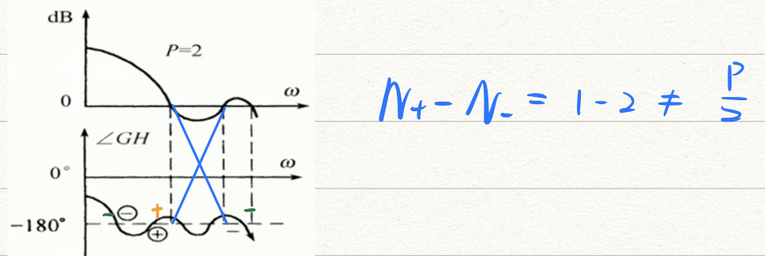

# 第五章 频域分析

* [Nequist图](#nequist图)
* [Bode图](#bode图)
* [Nequist图稳定判据](#nequist图稳定判据)
* [Bode图稳定判据](#bode图稳定判据)
* [系统相对稳定性及稳定裕度](#系统相对稳定性及稳定裕度)
* [频率特性与系统性能的关系](#频率特性与系统性能的关系)

-----

分析系统在不同频率的正弦信号输入下的稳态性能

**【频率特性$G(jw)$】**:
$$
\frac{输出稳态分量的复数形式}{输入的复数形式} \\
先求出传递函数G(W)，将s=jw带入得到频率特性G(jw)
$$

- <u>线性定常系统</u>满足输出信号只改变输入信号的幅值和相角，不改变其频
- **解析表示**
  - 实频-虚频：$G(jw)=U(w)+jV(w)$
  - 幅频-相频：$G(jw)=A(w)e^{j\varphi(w)}$
    - $A(w)=|G(j w)|=\sqrt{U^{2}(\omega)+V^{2}(\omega)}$
    - $\varphi(w)=\angle G(j w)=\operatorname{tg}^{-1} \frac{V(\omega)}{U_{(\omega)}}$
- **图的表示**
  - Nequist图：幅相频率特性图（极坐标）
  - Bode图：对数频率特性图
  - Nichols图：对数幅相图
- 分析闭环特征，只需绘制开环频率特性图

## Nequist图

$w:0\rightarrow +\infin$时，$G(jw)$的幅值和相角随$w$变化的轨迹

1. 写出$G(jw)$的表达式
2. 判断象限
3. 特征点：起点、终点、实轴交点、虚轴交点
4. 曲线方向为$w$增大的方向

**🌟【典型环节】**

- 比例环节：$G(jw)=K$
- 积分环节：$G(jw)=\frac{1}{jw}$
- 微分环节：$G(jw)=jw$
- 惯性环节：$G(jw)=\frac{1}{jTw+1}$
- 一阶微分环节：$G(jw)=1+jw\tau$
- 振荡环节：$G(jw)=\frac{1}{T^2s^2+2\zeta Ts+1}$
- 二阶微分：$G(jw)=1+2\zeta \tau s + \tau^2s^2$
- 延时环节：$G(jw)=e^{-j\tau w}=cos\tau w - jsin\tau w$

> 🌰【Nequist图绘制例题 * 2】P51

**【Nequist图与系统型别】**

- 起点：
  - 0型系统起点一定在正实轴上
  - $I$型及以上系统起点一定来源于正无穷远处，角度为$-90^{\circ}v$
- 终点：$n>m$时（分母阶次高），一定会回到原点，角度为$(n-m)*(-90^{\circ})$

## Bode图

- **坐标轴**
  - 横轴按$w$标定，$lgw$刻度，没有0点
  - 纵轴$20lg|G(jw)|$标定，均匀刻度，有0点
- **最小相位系统**
  - 具有相同幅频特性的系统中，最小相位系统的相角范围最小
  - 对数幅频特性和相频特性变化趋势基本一致

**【典型环节】**

**【Bode图求传递函数】**

1. 确定系统的组成环节：找转折频率，根据斜率变化确定各个环节
2. 确定K和v
   - 低频可以知道是几型系统
   - 一定过$(1,20lgk)$，斜率为$-20v \ dB/dec$
   - 与零分贝线交点处的频率为$w=\sqrt[v]{K}$
3. 振荡环节
   - **谐振峰值**：$M_r=\frac{1}{2\zeta\sqrt{1-\zeta^2}}$（注意在Bode的坐标轴上应该是 $20lgM_r = ...$

> 🌰
>
> 

**【Bode图的绘制】**

- 系统幅频特性 = 组成各典型环节的幅频特性<u>乘积</u>
- 相频特性 = 组成各典型环节的相频特性<u>代数和</u>
- 低频段只跟比例环节和型别有关 $lim_{w\rightarrow0}G(jw)=\frac{K}{(jw)^v}$
- 有过点$(1,20lgK)$，斜率为$-20v \ dB/dec$的直线
- 与0dB线交点处的频率为$w=\sqrt[v]{K}$
- 向右绘制的过程中，没遇到一个<u>转折频率</u>改变一次斜率

## Nequist图稳定判据

- 幅角定理（看不懂）：当S按顺时针沿封闭曲线D连续的变化一周时，曲线F(S)在复平面也按顺时针方向包围原点$N=Z-P$圈

- 增补完的曲线只是顺时针包围$(-1,j_0)$点，闭环系统一定不稳定

- 若系统开环稳定(p=0)，则若增补完的图逆时针包围$(-1,j_0)$零圈，则系统稳定

- **稳定判据**

  1. **增补完整的Nequist曲线**，逆时针方向包围$(-1,j_0)$点P圈

     - P为开环传函正实部极点个数
     - 若$G(jw)H(jw)$通过点$(-1,j_0)$，则该闭环系统产生等幅振荡，系统临界稳定

     

     > 🌰【绘制增补完整的Nequist曲线】

   >

  2. **简化版**

     

  3. **穿越版**

     

     

> 🌰【根据Nequist图判断系统稳定性 * 2】P60

## Bode图稳定判据

- **正穿越**：相位增大的方向

> 🌰
>
> 

------

## 系统相对稳定性及稳定裕度

- **剪切频率**$w_c$：开环频率特征幅值为1时的$w$ （Bode图上与横轴的交点）
- **相角裕度**$\gamma$：$180^{\circ}+\varphi(w_c)$（求的实际上是频率特性为1时的相角裕$-180^{\circ}$的距离
  - 对于p=0的系统，$\gamma>0$时系统稳定，$\gamma$越大系统相对稳定性越高
- 相位穿越频率$w_g$：开环相频特性为$-180^{\circ}$的$w$
- **幅值裕度**$K_g$：$\frac{1}{|G(jw_g)H(jw_g)|}$
  - $K_g(dB) = 20lgK_g$
  - 对于p=0的系统，$k_g>1, K_g(dB)>0$时系统稳定，$K_g$越大，相对稳定性越高

【闭环频率特性图】（略）

## 频率特性与系统性能的关系

- **时域指标**

  - 稳态：$e_{ss},\ v,\ K$
  - 动态：$t_s, \ \sigma \% , \ t_r, \, t_p, \ N$

- **频率指标**

  - 开环：$w_c, \ \gamma, \ K_g$

  - 闭环（略）

    

- 表示阻尼大小的指标：$\zeta, \ \sigma\%, \ \gamma, \ M_r$

- 表示响应速度的指标：$t_s, \ w_c, \ w_b$

- 阻尼比一定时，剪切频率$w_c$越大，系统响应越快

**【开环】**

- $\sigma\%$与$\gamma$：成反比
  - 通过增大系统的阻尼比，可以减小超调，增大相对稳定性
  - 一般要欠阻尼，有点超调加速稳定，同时又不影响整体稳定性
- $w_c$与$t_s$：成反比
  - 调整时间越小，动态性能越好
  - 此时需要$w$增大，$w_c$往右移
- 高阶系统经验公式（略）
- 闭环系统的动态性能主要取决于开环对数幅频特性的中频段$\gamma, \ w_c$

**【闭环】**（略）

