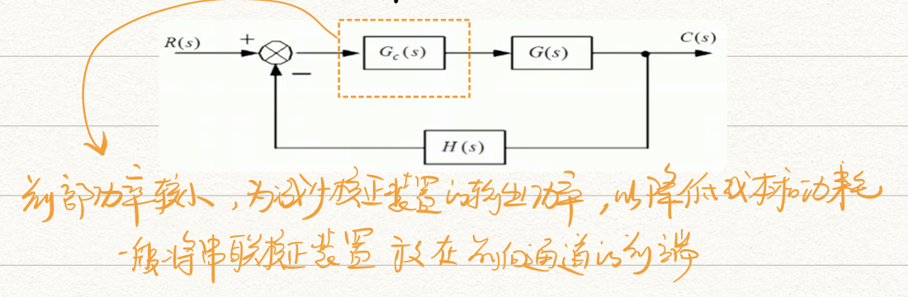
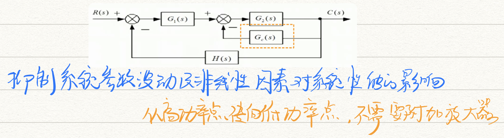
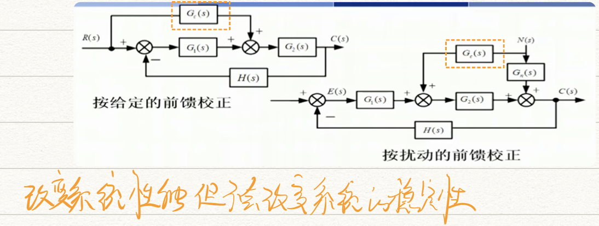
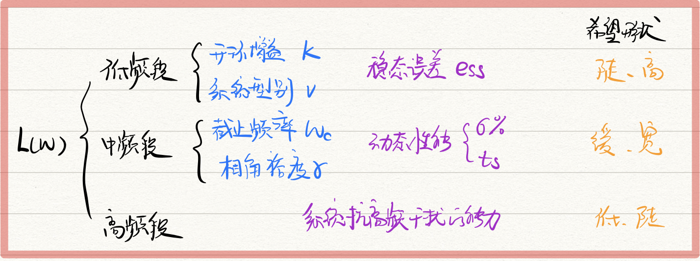
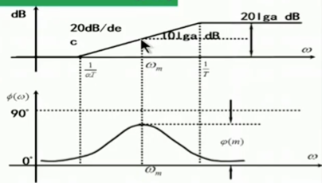
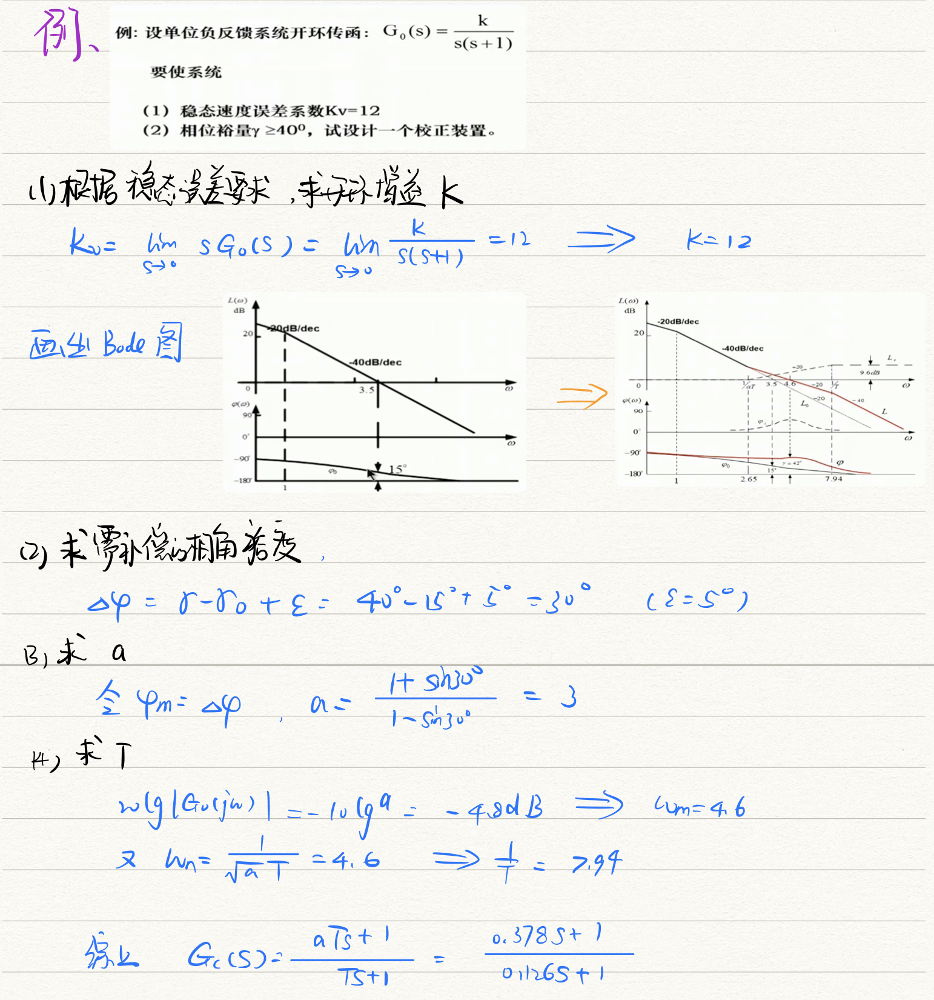
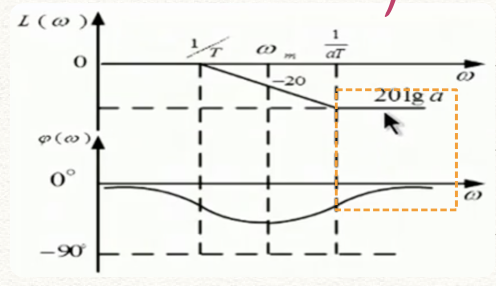
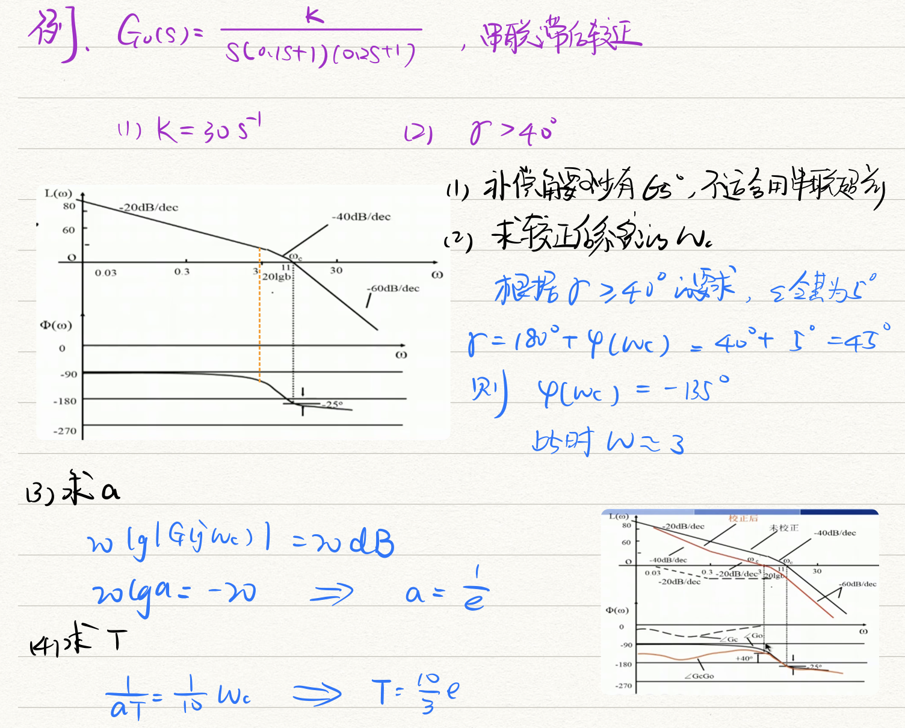
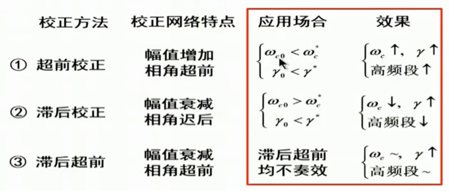

# 第六章 系统的设计与校正

- **改善系统性能**

  - 调整参数
  - 增加校正环节

- **系统性能指标**

  - 稳态精度（稳态误差）：静态误差系数 $K_p, \ K_v, \ K_a$
  - 稳定裕度（相对稳定性）：相角裕量、增益裕度$K_g$、谐振峰值、超调量、阻尼比
  - 动态性能（响应速度）：上升时间$t_r$、调整时间$t_s$、剪切频率$w_c$、带宽$w_d$、谐振频率$w_r$

- **系统带宽**：

  - 精确跟踪输入信号（低频）：要求系统有较大带宽
  - 抑制噪声（高频）：不想系统带宽过大

- **🌟系统校正方法**

  - 串联校正

    

  - 反馈校正

    

  - 前馈校正

    

  - 复合校正

- **校正装置分类**：自身有无放大能力

  - 无源校正装置：自身无放大功能，信号传递中幅值会衰减，需要附加放大器
  - 有源校正装置：由放大器和RC网络共同组成，自身即具有放大和补偿能力

## 频率法进行系统校正

【三频段理论】

## 串联超前校正

- 串联装置有<u>正的相位角</u>，使系统总的相角裕度$\gamma$变大，改善动态性能，提高系统稳定性
- 主要针对<u>中频段</u>
- **分类比较**
  - PD控制器：$G_c(s) = K_p(t+\tau s)$ 放大 微分
  - PD-惯性：$G_c(s)=K\frac{1+aTs}{1+Ts}, \ (a>1)$ 放大 微分 惯性
  - PD超前校正作用 > 带惯性环节的PD
  - 但惯性在提高系统抗干扰能力方面更突出
- **实质**：利用相角超前特性提高系统的相角裕度
  - 增大$w_c$处正相角，提高系统相角裕度	$\gamma \uparrow$
  - 减小$w_c$处的负斜率，提高系统稳定性   缓（极大$\gamma$处有一个正的dB）
  - 提高系统的频带宽度，提高系统响应速度   $w_c \uparrow宽$
- **模型**：$\frac{1+aTs}{1+Ts}$
- **最大可补偿角度**：$\varphi_m=sin^{-1}\frac{a-1}{a+1}$
  - 此时$20lg|G(jw)|=10lga \ (dB)$
  - a越大，补偿角度越大，但越接近PD微分，抗高频干扰越差
- **限制**：一般补偿角度不超过$65^{\circ}$，若原系统不稳定，或稳定裕度很小且剪切频率附近有较大负斜率时，不宜采用超前校正

1. **计算原系统性能**：绘制系统Bode图，求出$w_{c0}, \gamma_0$
2. **计算所需补偿的超前相角**：$\Delta\varphi = \gamma-\gamma_0+\varepsilon$
   - 附加$\varepsilon(5^{\circ} \sim 12^{\circ})$
   - 补偿校正后系统$w_c$右移引起的原系统相位滞后角
3. **计算校正装置参数**
   1. 取$\varphi m=\Delta\varphi$，解$a=\frac{1+sin\varphi m}{1-sin\varphi m}$
   2. 为充分利用网络，应使$w_m$为校正后系统的$w_c$；即找出原系统幅值为$-10lga \ dB$的频率$w_m$
   3. 由$w_m=\frac{1}{\sqrt{a}T}$解得T
   4. 则超前校正传函为：$G_c(s)=\frac{1+aTs}{1+Ts}$
4. **验证指标**

> 🌰【超前校正例题】
>
> 

## 串联滞后校正

- 降低系统的剪切频率，提高稳定裕度$\gamma$，改善动态性能和稳定性
- 核心使用这部分让$w_c$减小，同时减小的$\varphi$又不会太小
- **核心**：
  1. 找原始Bode图中那一点满足相角裕度$\gamma$要求，让这里的频率为新的$w_c$
  2. $L(w_c)=-20lga \ (a < 1)$
  3. 取滞后网络的第二转折频率$\frac{1}{aT}=\frac{1}{10}w_c$，解出T值

> 🌰【串联滞后校正例题】
>
> 

## 串联超前/滞后比较

核心都是提高系统性能，尤其是讨论$\gamma$，希望它越大越好

$\gamma=180^{\circ}+\varphi(w_c)$

- 超前：直接在$\gamma$表达式后面再加一项$\varphi(w_n)$，让$\gamma$整体大一点
- 滞后：另一种思路是让$\gamma$还挺大时（还没衰减下去时），就达到$w_c$，也就是让$w_c$提前一点，让幅频整体下移一些

- 先确定超前，再确定滞后，应留有裕量

